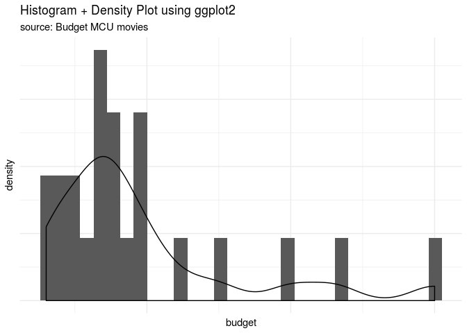

Marvel Cinematic Universe
================
mr.ikanx
12/1/2019

# Marvel CInematics Universe

## Pendahuluan

Siapa sih yang gak pernah nonton minimal satu film dari Marvel Cinematic
Universe?

Dimulai dari film **Iron Man** pertama dan diakhiri sampai **Spiderman
Far From Home** yang *release* di tahun ini.

Dari sekian banyak film tersebut, pasti ada sekian film yang menjadi
favorit banyak orang. Salah satu parameternya adalah tingginya
pendapatan yang diterima oleh film tersebut.

Disadari atau tidak, film yang bagus biasanya dibuat dengan serius juga.
Salah satu parameter suatu film digarap dengan serius dapat dilihat dari
*budget* pembuatan film tersebut.

## Budget vs Box Office

Dari data yang didapatkan, mari kita lihat hubungan dan apakah mungkin
dibuat model antara *budget* dan *box office* dari film-film di
**MCU**?

``` r
data=read.csv('/cloud/project/Materi Training/GIZ/Latihan SOAL/Marvel Cinematic Universe.csv')
str(data)
```

    ## 'data.frame':    23 obs. of  5 variables:
    ##  $ X                   : int  1 2 3 4 5 6 7 8 9 10 ...
    ##  $ release_date        : Factor w/ 23 levels "Apr 26, 2019",..: 7 1 12 9 2 5 21 10 17 22 ...
    ##  $ title               : Factor w/ 23 levels "Ant-Man","Ant-Man and the Wasp",..: 17 4 10 2 5 6 22 18 13 11 ...
    ##  $ production_budget   : int  160000000 400000000 175000000 130000000 300000000 200000000 180000000 175000000 200000000 165000000 ...
    ##  $ worldwide_box_office: num  1.13e+09 2.80e+09 1.13e+09 6.23e+08 2.05e+09 ...

Kalau kita lihat, dari dataset terdapat variabel-variabel berikut ini:

  - `X`: nomor urut
  - `release_date`: tanggal *release* film
  - `title`: judul film **MCU**
  - `production_budget`: *budget* produksi film
  - `worldwide_box_office`: pendapatan film *worldwide*

Nah, sebenarnya tidak semua data ini kita butuhkan yah. Minimal kita
hanya butuh judul film dan dua variabel yang akan kita buat modelnya.

*So*, mari kita bebersih dulu.

``` r
library(dplyr)
data = 
  data %>% mutate(X=NULL,release_date=NULL)
colnames(data) = c('judul','budget','box_office')
head(data)
```

    ##                       judul    budget box_office
    ## 1 Spider-Man: Far From Home 160000000 1131723455
    ## 2         Avengers: Endgame 400000000 2797800564
    ## 3            Captain Marvel 175000000 1126129839
    ## 4      Ant-Man and the Wasp 130000000  623144660
    ## 5    Avengers: Infinity War 300000000 2048359754
    ## 6             Black Panther 200000000 1348258224

``` r
summary(data)
```

    ##                      judul        budget            box_office       
    ##  Ant-Man                : 1   Min.   :130000000   Min.   :2.656e+08  
    ##  Ant-Man and the Wasp   : 1   1st Qu.:155000000   1st Qu.:6.222e+08  
    ##  Avengers: Age of Ultron: 1   Median :175000000   Median :8.540e+08  
    ##  Avengers: Endgame      : 1   Mean   :195395652   Mean   :9.820e+08  
    ##  Avengers: Infinity War : 1   3rd Qu.:200000000   3rd Qu.:1.184e+09  
    ##  Black Panther          : 1   Max.   :400000000   Max.   :2.798e+09  
    ##  (Other)                :17

## Statistika deskripsi

Sebelum mulai bagian serunya, kita akan liat statistika deskripsi dari
variabel `budget` dan `box_office` yuk.

### Budget

Mari kita lihat sebaran dari variabel `budget`.

``` r
library(ggplot2)
#histogram dengan ggplot2
data %>% 
  ggplot(aes(x=budget)) +
  geom_histogram(aes(y=..density..)) +
  geom_density() +
  labs(title='Histogram + Density Plot using ggplot2',
       subtitle='source: Budget MCU movies') +
  theme_minimal() +
  theme(axis.text = element_blank())
```

<!-- -->

``` r
#histogram dengan base
hist(data$budget)
```

<!-- -->

``` r
#boxplot dengan base
data %>% ggplot(aes(y=budget)) + geom_boxplot()
```

<!-- -->

Dari sebaran datanya, terlihat bahwa `budget` agak miring ke kiri. Ada
tiga film yang memiliki budget sangat tinggi yang berada di luar
jangkauan **boxplot**-nya.

Apakah `budget` berdistribusi normal? Kita lakukan uji *shapiro-wilk*

``` r
stat_uji = shapiro.test(data$budget)
ifelse(stat_uji$p.value < 0.05,
       'Tolak H0 -- tidak normal',
       'H0 tidak ditolak -- normal')
```

    ## [1] "Tolak H0 -- tidak normal"

Ternyata didapatkan bahwa variabel `budget` **tidak berdistribusi
normal**.

### Box Office

Sekarang giliran kita lihat sebaran dari variabel `Box Office`.

``` r
library(ggplot2)
#histogram dengan ggplot2
data %>% 
  ggplot(aes(x=box_office)) +
  geom_histogram(aes(y=..density..)) +
  geom_density() +
  labs(title='Histogram + Density Plot using ggplot2',
       subtitle='source: Box Office MCU movies') +
  theme_minimal() +
  theme(axis.text = element_blank())
```

<!-- -->

``` r
#histogram dengan base
hist(data$box_office)
```

<!-- -->

``` r
#boxplot dengan base
data %>% ggplot(aes(y=box_office)) + geom_boxplot()
```

<!-- -->

Dari sebaran datanya, terlihat bahwa `box_office` agak miring ke kiri.
Ada dua film yang memiliki *box\_office* sangat tinggi yang berada di
luar jangkauan **boxplot**-nya. *Menarique*, ternyata ada dua yang
tinggi sedangkan tadi pas *budget* ada tiga film.

Apakah `box_office` berdistribusi normal? Kita lakukan uji
*shapiro-wilk*

``` r
stat_uji = shapiro.test(data$box_office)
ifelse(stat_uji$p.value < 0.05,
       'Tolak H0 -- tidak normal',
       'H0 tidak ditolak -- normal')
```

    ## [1] "Tolak H0 -- tidak normal"

Ternyata didapatkan bahwa variabel `box_office` **tidak berdistribusi
normal**.
